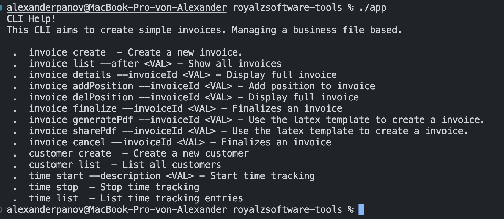

# Small Business Management CLI

## Features
- file based (`data.json`)
- simple time tracking with description
- customer management
    - create customer with name, address and email
- invoice management
    - create positions
    - delete positions
- invoice pdf creation with LaTeX
- no 3rd party dependencies
- develop as you go

## Preview

